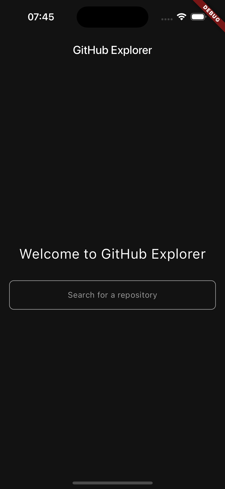
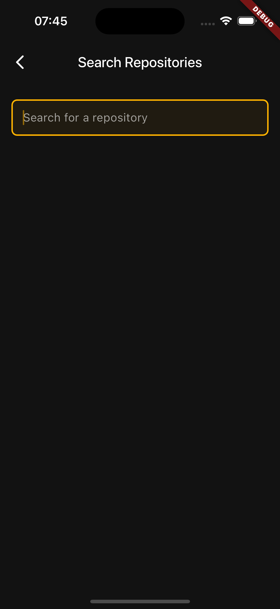
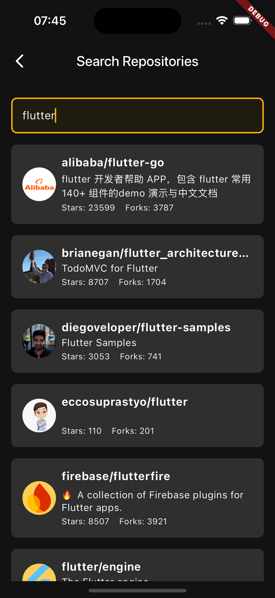
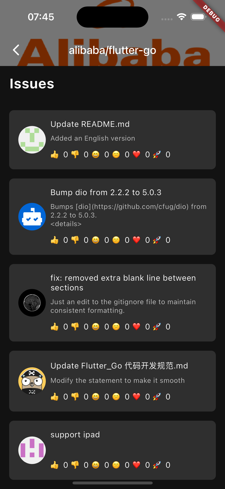
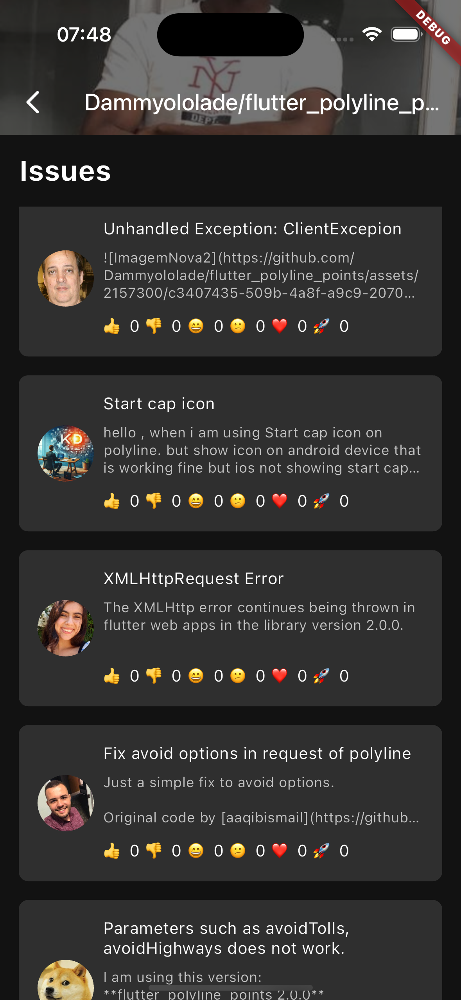

# flutter_github_explorer

FlutterGithubExplorer is a Flutter app for searching and exploring open-source GitHub repositories.
Features include repository search with pagination, detailed repository information, and a list of open issues.
Built with BLoC state management and clean architecture, it ensures a responsive and maintainable codebase.


## Run the app
To run the app, you need to have Flutter installed on your machine. 
If you don't have it installed, you can follow the instructions [here](https://flutter.dev/docs/get-started/install).

After installing Flutter, you can run the app by following these steps:
1. Clone the repository
```bash
git clone
```
2. Navigate to the project directory
```bash
cd flutter_github_explorer
```
3. Get the dependencies
```bash
flutter pub get
```
4. Run the app
```bash
flutter run
```

## Run the tests
To run the tests, you can use the following command:
```bash
flutter test
```

## Architecture
The app is built using the clean architecture pattern, which separates the app into three layers:
- Presentation: Contains the UI components and the BLoC classes that manage the app's state.
- Domain: Contains the business logic of the app, including the use cases and the repository interfaces.
- Data: Contains the implementation of the repository interfaces, as well as the data sources.

The app uses the BLoC state management pattern to manage the app's state. 
The BLoC classes are responsible for handling the business logic and emitting state changes to the UI components.

The app uses the repository pattern to abstract the data sources from the rest of the app.
The repository interfaces are defined in the domain layer, and the implementation is provided in the data layer.

## Networking
The app uses the dio package to make HTTP requests to the GitHub API.

## Testing
The app uses the bloc_test package to test the BLoC classes.
All the BLoC classes have unit tests that test the business logic and state transitions.
The tests are located in the test directory and can be run using the `flutter test` command.
The app used the mockito package to mock the repository interfaces in the tests.

## Dependencies
The app uses the following dependencies:
- dio: For making HTTP requests to the GitHub API.
- bloc: For implementing the BLoC state management pattern.
- equatable: For comparing objects in the BLoC classes.
- flutter_bloc: For providing BLoC classes to the widget tree.
- get_it: For dependency injection.
- mockito: For mocking objects in the tests.
- bloc_test: For testing the BLoC classes.
- flutter_test: For testing the UI components.
- json_annotation: For generating JSON serialization code.
- build_runner: For running code generation tasks.
- json_serializable: For generating JSON serialization code.

## Screenshots







## View docs
To view the documentation, you can run the following command:
```bash
flutter pub run dartdoc
dart pub global activate dhttpd
dart pub global run dhttpd --path doc/api
```
Then, you can open the browser and navigate to http://localhost:8080 to view the documentation.

